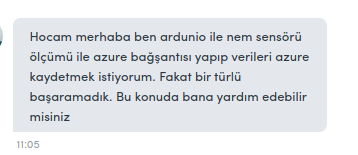

## nem sensörü ile elde edilen verileri azure üzerinden gönderme

yapılacaklar:
===============
- Nem sensörü ile verileri oku
- Azure bağlantısı kur ve yolla

linkler:
https://docs.microsoft.com/tr-tr/azure/storage/blobs/storage-quickstart-blobs-python
https://docs.microsoft.com/en-us/azure/storage/files/storage-python-how-to-use-file-storage?tabs=python
https://github.com/Azure/azure-sdk-for-pythonhttps://github.com/Azure/azure-sdk-for-python
https://gist.github.com/valleyjo/02e3735b064818881727

azure bilgisinin yer aldığı kısım : http://omereryilmaz.com/arduino-ile-azure-mobile-services-baglantisi-iot/
